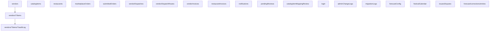
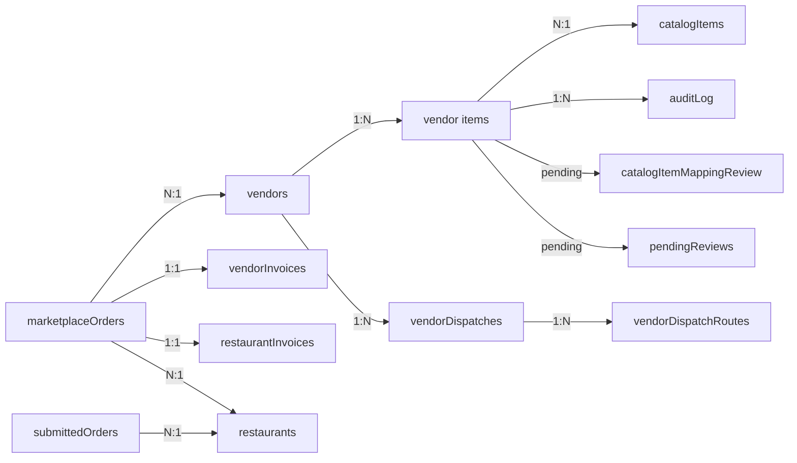

# RestIQ Marketplace — Firestore Data Structure

Complete schema reference for every Firestore collection used in the project. All system timestamps use Firestore `Timestamp` objects via `serverTimestamp()`. Business planning date keys (e.g. `weekStart`, `deliveryDateKey`) remain as ISO strings.

---

## Collection Hierarchy

---

## 1. `vendors`

Master vendor/supplier profiles.

| Field | Type | Description |
|---|---|---|
| `name` | string | Company display name |
| `companyName` | string | Legal company name |
| `contactPerson` | string | Primary contact name |
| `phone` | string | Phone number |
| `email` | string | Contact email |
| `address` | string | Street address |
| `city` | string | City |
| `province` | string | Province/state code (e.g. `"ON"`) |
| `country` | string | Country (e.g. `"Canada"`) |
| `category` | string | Vendor category |
| `status` | string | `"active"` \| `"inactive"` |
| `commissionPercent` | number | Marketplace commission % (default 10) |
| `notes` | string | Admin notes |
| `createdAt` | Timestamp | Server-set creation time |
| `updatedAt` | Timestamp | Server-set last update time |

---

## 2. `vendors/{vendorId}/items`

Items offered by a specific vendor. Subcollection under each vendor.

| Field | Type | Description |
|---|---|---|
| `name` | string | Item display name |
| `category` | string | `"Produce"` \| `"Meat"` \| `"Seafood"` \| `"Dairy"` \| `"Spices"` \| `"Grains"` \| `"Beverages"` \| `"Packaging"` \| `"Cleaning"` \| `"Other"` |
| `unit` | string | Selling unit (`"kg"`, `"lb"`, `"bag"`, `"bunch"`, `"box"`, `"case"`, `"unit"`, `"dozen"`, `"packet"`, `"L"`, `"mL"`) |
| `vendorPrice` | number | Price charged by vendor |
| `packQuantity` | number | Pack size (e.g. 10 kg/bag) |
| `taxable` | boolean | Whether item is taxable |
| `imageUrl` | string | Product image URL (Firebase Storage) |
| `catalogItemId` | string \| null | Link to master `catalogItems` doc |
| `status` | string | `"active"` \| `"in-review"` \| `"rejected"` \| `"inactive"` |
| `changeType` | string | `""` \| `"edit"` \| `"add"` \| `"delete"` \| `"deactivate"` (pending review state) |
| `proposedData` | object \| null | Pending proposed changes |
| `originalData` | object \| null | Snapshot of original data before change |
| `requestedBy` | string | User ID who requested change |
| `requestedByName` | string | Display name of requester |
| `requestedAt` | Timestamp \| null | When change was requested |
| `rejectionComment` | string | Reason for rejection (if rejected) |
| `proofUrls` | array | `[{ name: string, url: string }]` — uploaded proof documents |
| `createdAt` | Timestamp | Server-set creation time |
| `updatedAt` | Timestamp | Server-set last update time |

---

## 3. `vendors/{vendorId}/items/{itemId}/auditLog`

Per-item audit trail. Subcollection under each vendor item.

| Field | Type | Description |
|---|---|---|
| `action` | string | `"edited_direct"` \| `"approved"` \| `"rejected"` \| `"price_change"` \| `"image_uploaded"` \| `"submit_for_review"` |
| `performedBy` | string | User ID who performed action |
| `performedByName` | string | Display name of performer |
| `itemName` | string | Item name at time of action |
| `originalData` | object | Fields before change |
| `proposedData` | object | Fields after change |
| `timestamp` | Timestamp | Server-set time of action |

---

## 4. `catalogItems`

Master product catalog — canonical deduplicated product references.

| Field | Type | Description |
|---|---|---|
| `catalogItemId` | string | Deterministic ID from normalized name |
| `canonicalName` | string | Official display name |
| `normalizedKey` | string | Lowercase normalized key for matching |
| `category` | string | Product category |
| `baseUnit` | string | Standard unit of measure |
| `packReference` | string | Reference pack size |
| `aliases` | string[] | Alternative names for this item |
| `vendorCount` | number | Number of vendors offering this item |
| `status` | string | `"active"` \| `"inactive"` |
| `createdAt` | Timestamp | Server-set creation time |
| `updatedAt` | Timestamp | Server-set last update time |

---

## 5. `catalogItemMappingReview`

Queue for vendor items needing manual catalog mapping (ambiguous names).

| Field | Type | Description |
|---|---|---|
| `vendorId` | string | Vendor doc ID |
| `vendorName` | string | Vendor display name |
| `itemId` | string | Vendor item doc ID |
| `itemName` | string | Vendor's item name |
| `suggestedNormalizedKey` | string | Auto-generated normalized key |
| `category` | string | Item category |
| `status` | string | `"pending"` \| `"mapped"` \| `"ignored"` |
| `resolvedCatalogItemId` | string | Catalog item it was mapped to |
| `resolvedAt` | Timestamp | When resolved |
| `createdAt` | Timestamp | Server-set creation time |

---

## 6. `restaurants`

Master restaurant/branch profiles.

| Field | Type | Description |
|---|---|---|
| `restaurantId` | string | Deterministic ID |
| `name` | string | Restaurant display name |
| `code` | string | Short code identifier |
| `branchType` | string | `"restaurant"` |
| `status` | string | `"active"` \| `"inactive"` |
| `phone` | string | Contact phone |
| `email` | string | Contact email |
| `addressLine1` | string | Street address |
| `city` | string | City |
| `province` | string | Province code |
| `postalCode` | string | Postal/ZIP code |
| `deliveryDays` | string[] | e.g. `["Monday", "Thursday"]` |
| `forecastEnabled` | boolean | Whether forecasting is active |
| `subscriptionPlan` | string | e.g. `"marketplace-basic"` |
| `notes` | string | Admin notes |
| `createdAt` | Timestamp | Server-set creation time |
| `updatedAt` | Timestamp | Server-set last update time |

---

## 7. `marketplaceOrders`

Live marketplace orders — the central transactional collection.

| Field | Type | Description |
|---|---|---|
| `orderGroupId` | string | Display group ID (e.g. `"A3F8B2C1"`) |
| `vendorId` | string | Assigned vendor |
| `vendorName` | string | Vendor display name |
| `restaurantId` | string | Ordering restaurant |
| `restaurantName` | string | Restaurant display name |
| `status` | string | See status enum below |
| `items` | array | Order line items (see below) |
| `subtotalBeforeTax` | number | Pre-tax subtotal |
| `totalTax` | number | Total tax amount |
| `total` | number | Grand total (subtotal + tax) |
| `issueStatus` | string | `null` \| `"open"` \| `"resolved"` |
| `issueDetails` | object | `{ type, description, raisedBy }` |
| `resolution` | object | `{ type, details, resolvedBy, resolvedAt: Timestamp }` |
| `auditLog` | array | `[{ action, reason, timestamp: Timestamp, user }]` |
| `cancelReason` | string | Reason for cancellation |
| `deliveredAt` | Timestamp | When marked delivered |
| `cancelledAt` | Timestamp | When cancelled |
| `resolvedAt` | Timestamp | When issue was resolved |
| `reviewWindowEndsAt` | string | Computed date: delivery + 48h (ISO) |
| `createdAt` | Timestamp | Server-set creation time |

**Order Status Enum:**
`"new"` → `"pending_confirmation"` → `"confirmed"` → `"delivered_awaiting_confirmation"` → `"fulfilled"`
Branch: → `"in_review"` → `"fulfilled"` (after resolution)
Branch: → `"cancelled_by_vendor"` / `"cancelled_by_customer"` / `"cancelled"` / `"rejected"`

**Order Line Item Shape:**

| Field | Type | Description |
|---|---|---|
| `itemId` | string | Vendor item doc ID |
| `itemName` / `name` | string | Item display name |
| `qty` | number | Quantity ordered |
| `price` / `vendorPrice` | number | Price at time of order |
| `unit` | string | Unit of measure |
| `taxable` | boolean | Whether this line is taxable |
| `lineSubtotal` | number | `price × qty` |

---

## 8. `submittedOrders`

Restaurant-submitted orders from the forecast review pipeline.

| Field | Type | Description |
|---|---|---|
| `suggestionId` | string | Deterministic doc ID |
| `restaurantId` | string | Restaurant identifier |
| `restaurantName` | string | Restaurant display name |
| `deliveryDay` | string | `"Monday"` \| `"Thursday"` |
| `weekStart` | string | ISO date for Monday of delivery week |
| `weekLabel` | string | Human-readable week label |
| `status` | string | `"Draft Suggestion"` → `"In Review"` → `"Submitted"` → `"Locked"` → `"Aggregated"` → `"Sent to Vendor"` |
| `submittedAt` | Timestamp | When submitted |
| `lockedAt` | Timestamp | When locked |
| `aggregatedAt` | Timestamp | When aggregated |
| `updatedAt` | Timestamp | Last status change |
| `predictedItemsCount` | number | AI predicted item count |
| `predictedTotalPacks` | number | AI predicted total packs |
| `finalItemsCount` | number | Final confirmed item count |
| `finalTotalPacks` | number | Final total packs |
| `changesCount` | number | Number of corrections |
| `netPackDelta` | number | Net change in packs |
| `predictionConfidence` | number | AI confidence score |
| `predictedEstimatedSpend` | number | Predicted spend |
| `finalEstimatedSpend` | number | Final spend |
| `spendDelta` | number | Spend difference |
| `items` | array | `[{ itemId, itemName, category, packLabel, predictedQty, finalQty, deltaQty, deltaType, note, totalQty, lineRestaurantBilling }]` |

---

## 9. `vendorDispatches`

Weekly parent dispatch records — one per vendor per week.

| Field | Type | Description |
|---|---|---|
| `dispatchId` | string | Deterministic ID: `disp_{vendorId}_{weekStart}` |
| `vendorId` | string | Vendor doc ID |
| `vendorName` | string | Vendor display name |
| `weekStart` | string | ISO date (Monday) |
| `weekEnd` | string | ISO date (Sunday) |
| `weekLabel` | string | Human-readable label |
| `routeDays` | string[] | `["Monday", "Thursday"]` |
| `mondayTotalPacks` | number | Monday pack count |
| `thursdayTotalPacks` | number | Thursday pack count |
| `restaurantBillingTotal` | number | Total restaurant billing |
| `vendorPayoutTotal` | number | Total vendor payout |
| `marketplaceCommissionTotal` | number | Total commission |
| `overallStatus` | string | Derived: `"Draft"` \| `"Sent"` \| `"In Progress"` \| `"Partial"` \| `"Confirmed"` \| `"Delivered"` \| `"Closed"` |
| `mondaySent` | boolean | Whether Monday dispatch was sent |
| `thursdaySent` | boolean | Whether Thursday dispatch was sent |
| `sentAt` | Timestamp | When dispatched |
| `confirmedAt` | Timestamp \| null | When confirmed |
| `deliveredAt` | Timestamp \| null | When delivered |
| `items` | array | Full items payload (see below) |
| `createdAt` | Timestamp | Server-set creation time |
| `updatedAt` | Timestamp | Server-set last update time |

**Dispatch Item Shape (with snapshot fields):**

| Field | Type | Description |
|---|---|---|
| `itemId` | string | Lowercased item name slug |
| `itemName` | string | Item display name |
| `packLabel` | string | Pack display string |
| `mondayQty` | number | Monday quantity |
| `thursdayQty` | number | Thursday quantity |
| `catalogSellPrice` | number | Catalog selling price |
| `lineMarketplaceCommission` | number | Commission for this line |
| `lineVendorPayout` | number | Vendor payout for this line |
| `lineRestaurantBilling` | number | Restaurant billing for this line |
| `category` | string | Item category |
| `vendorItemId` | string \| null | **Snapshot:** vendor item doc ID |
| `catalogItemId` | string \| null | **Snapshot:** catalog item ID |
| `itemNameSnapshot` | string | **Snapshot:** item name at dispatch time |
| `priceSnapshot` | number | **Snapshot:** vendor price at dispatch time |
| `unitSnapshot` | string | **Snapshot:** unit at dispatch time |
| `vendorNameSnapshot` | string \| null | **Snapshot:** vendor name |
| `packSizeSnapshot` | number \| null | **Snapshot:** pack quantity |
| `categorySnapshot` | string \| null | **Snapshot:** category |
| `taxableSnapshot` | boolean | **Snapshot:** taxable flag |

---

## 10. `vendorDispatchRoutes`

Route-day child dispatch records — pipeline tracking per delivery day.

| Field | Type | Description |
|---|---|---|
| `routeDispatchId` | string | `{dispatchId}_{Day}` |
| `dispatchId` | string | Parent dispatch ID |
| `vendorId` | string | Vendor doc ID |
| `vendorName` | string | Vendor display name |
| `weekStart` | string | ISO date (Monday) |
| `weekEnd` | string | ISO date (Sunday) |
| `weekLabel` | string | Human-readable label |
| `routeDay` | string | `"Monday"` \| `"Thursday"` |
| `totalPacks` | number | Total packs for this route |
| `status` | string | `"Draft"` \| `"Sent"` \| `"Confirmed"` \| `"Partially Confirmed"` \| `"Delivered"` \| `"Closed"` |
| `sentAt` | Timestamp | When sent to vendor |
| `confirmedAt` | Timestamp \| null | When vendor confirmed |
| `deliveredAt` | Timestamp \| null | When delivered |
| `warehouseStatus` | string \| null | Warehouse processing status |
| `items` | array | Route-filtered items (same shape as dispatch items + `qty` field) |
| `notes` | string | Route notes |
| `createdAt` | Timestamp | Server-set creation time |
| `updatedAt` | Timestamp | Server-set last update time |

---

## 11. `vendorInvoices`

Auto-generated vendor invoices (commission deducted). Doc ID = order ID.

| Field | Type | Description |
|---|---|---|
| `orderId` | string | Linked marketplace order ID |
| `orderGroupId` | string | Display group ID |
| `vendorId` | string | Vendor doc ID |
| `restaurantId` | string | Restaurant identifier |
| `invoiceNumber` | string | `INV-V-{base}` |
| `invoiceDate` | Timestamp | Invoice generation date |
| `dueDate` | string | ISO date (30 days from creation) |
| `paymentStatus` | string | `"PENDING"` \| `"PAID"` |
| `subtotalVendorAmount` | number | Pre-tax subtotal |
| `totalTaxAmount` | number | Total tax |
| `totalVendorAmount` | number | Gross total (subtotal + tax) |
| `grossVendorAmount` | number | Same as subtotalVendorAmount |
| `commissionPercent` | number | Commission rate |
| `commissionAmount` | number | Commission deducted |
| `netVendorPayable` | number | Gross − commission |
| `commissionModel` | string | `"VENDOR_FLAT_PERCENT"` |
| `items` | array | `[{ itemId, itemName, unit, qty, vendorPrice, lineTotalVendor, isTaxable, lineTax }]` |
| `adminNotes` | string | Generation method note |
| `createdAt` | Timestamp | Server-set creation time |
| `updatedAt` | Timestamp | Server-set last update time |

---

## 12. `restaurantInvoices`

Auto-generated restaurant invoices (full amount, no commission). Doc ID = order ID.

| Field | Type | Description |
|---|---|---|
| `orderId` | string | Linked marketplace order ID |
| `orderGroupId` | string | Display group ID |
| `vendorId` | string | Vendor doc ID |
| `vendorName` | string | Vendor display name |
| `restaurantId` | string | Restaurant identifier |
| `invoiceNumber` | string | `INV-C-{base}` |
| `invoiceDate` | Timestamp | Invoice generation date |
| `dueDate` | string | ISO date (30 days from creation) |
| `paymentStatus` | string | `"PENDING"` \| `"PAID"` |
| `subtotal` | number | Pre-tax subtotal |
| `totalTax` | number | Total tax |
| `grandTotal` | number | Subtotal + tax |
| `items` | array | `[{ itemId, itemName, unit, qty, price, lineTotal, isTaxable, lineTax }]` |
| `adminNotes` | string | Generation method note |
| `createdAt` | Timestamp | Server-set creation time |
| `updatedAt` | Timestamp | Server-set last update time |

---

## 13. `notifications`

Real-time notification system for admins and vendors.

| Field | Type | Description |
|---|---|---|
| `orderId` | string | Related order ID |
| `type` | string | `"NEW_ORDER"` \| `"ORDER_CANCELLED"` \| `"STATUS_CHANGED"` \| `"DELIVERY_CONFIRMED"` \| `"ISSUE_RAISED"` \| `"ORDER_UPDATED"` \| `"ITEM_ADDED"` \| `"ITEM_EDIT_SUBMITTED"` |
| `role` | string | `"ADMIN"` \| `"VENDOR"` |
| `vendorId` | string | Target vendor (for vendor notifications) |
| `title` | string | Notification title |
| `message` | string | Notification body |
| `isRead` | boolean | Read status |
| `createdAt` | Timestamp | Server-set creation time |

---

## 14. `pendingReviews`

Legacy review queue for vendor item changes (superseded by inline review in `PendingReviewsDashboard`).

| Field | Type | Description |
|---|---|---|
| `vendorId` | string | Vendor doc ID |
| `itemId` | string | Vendor item doc ID |
| `itemName` | string | Item name |
| `vendorName` | string | Vendor display name |
| `changeType` | string | `"edit"` \| `"delete"` |
| `originalData` | object | Fields before change |
| `proposedData` | object | Proposed changes |
| `requestedBy` | string | User ID |
| `requestedByName` | string | User display name |
| `requestedAt` | Timestamp | When request was made |
| `status` | string | `"pending"` \| `"approved"` \| `"rejected"` |
| `reviewedBy` | string | Admin user ID who reviewed |
| `reviewedByName` | string | Admin display name |
| `reviewedAt` | Timestamp | When reviewed |
| `rejectionComment` | string | Reason for rejection |

---

## 15. `login`

User accounts and authentication.

| Field | Type | Description |
|---|---|---|
| `displayName` | string | User display name |
| `username` | string | Login username (lowercase) |
| `email` | string \| null | Email address |
| `password` | string | Password (plain text — dev only) |
| `role` | string | `"superadmin"` \| `"admin"` \| `"vendor"` |
| `vendorId` | string | Associated vendor doc ID |
| `vendorName` | string | Associated vendor name |
| `active` | boolean | Account active status |
| `createdBy` | string | User ID who created this account |
| `createdAt` | Timestamp | Server-set creation time |

---

## 16. `adminChangeLogs`

Admin audit trail for all administrative actions.

| Field | Type | Description |
|---|---|---|
| `entityType` | string | `"restaurant"` \| `"catalogItem"` \| `"vendorItem"` \| `"mappingReview"` |
| `entityId` | string | Document ID that was changed |
| `action` | string | `"created"` \| `"updated"` \| `"status_changed"` \| `"mapped"` \| `"ignored"` \| `"bulk_update"` \| `"deleted"` \| `"review_approved"` \| `"review_rejected"` |
| `changedBy` | string | User display name |
| `changedFields` | object | `{ field: { from, to } }` |
| `metadata` | object | Additional context |
| `timestamp` | Timestamp | Server-set time of action |

---

## 17. `migrationLogs`

Records of data migration/backfill runs.

| Field | Type | Description |
|---|---|---|
| `type` | string | `"restaurantsBackfill"` \| `"catalogItemsBackfill"` |
| `startedAt` | string | ISO timestamp of job start |
| `completedAt` | string | ISO timestamp of job end |
| `status` | string | `"completed"` \| `"completed_with_errors"` |
| `totalProcessed` | number | Total items scanned |
| `totalCreated` | number | New documents created |
| `totalUpdated` | number | Documents updated |
| `totalSkipped` | number | Skipped (already existed) |
| `totalNeedsReview` | number | Sent to review queue |
| `errorCount` | number | Errors encountered |
| `notes` | string | Summary description |
| `createdAt` | Timestamp | Server-set creation time |

---

## 18. `forecastConfig`

Global forecast engine configuration. Single document: `forecastConfig/global`.

| Field | Type | Description |
|---|---|---|
| `safetyBufferPercent` | number | e.g. `0.15` (15% safety buffer) |
| `defaultMondaySplit` | number | e.g. `0.40` (40% Mon-Wed allocation) |
| `defaultThursdaySplit` | number | e.g. `0.60` (60% Thu-Sun allocation) |

---

## 19. `festivalCalendar`

Festival/seasonal event calendar for forecast demand uplift.

| Field | Type | Description |
|---|---|---|
| `eventName` | string | Event name (e.g. `"Onam Week"`) |
| `startDate` | string | ISO date (start) |
| `endDate` | string | ISO date (end) |
| `isActive` | boolean | Whether event is active |
| `notes` | string | Event notes |
| `upliftRules` | array | `[{ targetType: "category", targetValue: string, percent: number }]` |

---

## 20. `issuesDisputes`

Delivery issues and disputes raised by restaurants.

| Field | Type | Description |
|---|---|---|
| `issueType` | string | `"Missing Item"` \| `"Incorrect Item"` \| `"Damaged Item"` \| `"Replacement Requested"` \| `"Short Quantity"` \| `"Wrong Pack Size"` |
| `restaurantName` | string | Restaurant name |
| `vendorName` | string | Vendor name |
| `itemName` | string | Affected item |
| `deliveryDay` | string | `"Monday"` \| `"Thursday"` |
| `description` | string | Issue description |
| `submittedOrderId` | string | Related submitted order |
| `dispatchId` | string | Related dispatch |
| `status` | string | `"Open"` \| `"Vendor Reviewing"` \| `"Replacement Approved"` \| `"Resolved"` \| `"Closed"` |
| `createdAt` | Timestamp | Server-set creation time |
| `updatedAt` | Timestamp | Server-set last update time |

---

## 21. `forecast/corrections/entries`

Item-level forecast correction data (learning engine). Subcollection under `forecast/corrections`.

| Field | Type | Description |
|---|---|---|
| `correctionId` | string | Auto-generated doc ID |
| `restaurantId` | string | Restaurant identifier |
| `restaurantName` | string | Restaurant display name |
| `itemId` | string | Item identifier |
| `itemName` | string | Item name |
| `category` | string | Item category |
| `deliveryDay` | string | `"Monday"` \| `"Thursday"` |
| `weekStart` | string | ISO date for week start |
| `weekLabel` | string | Human-readable week label |
| `predictedQty` | number | AI predicted quantity |
| `finalQty` | number | Restaurant's final quantity |
| `deltaQty` | number | `finalQty - predictedQty` |
| `deltaType` | string | `"Added"` \| `"Removed"` \| `"Increased"` \| `"Reduced"` \| `"Unchanged"` |
| `packLabel` | string | Pack unit label |
| `catalogPrice` | number | Catalog price at time |
| `submittedAt` | Timestamp | Server-set time of submission |
| `suggestionId` | string | Parent submitted order ID |

---

## Key Relationships

---

## Timestamp Convention Summary

| Category | Example Fields | Type | Notes |
|---|---|---|---|
| System events | `createdAt`, `updatedAt`, `sentAt`, `confirmedAt`, `deliveredAt`, `cancelledAt`, `resolvedAt`, `reviewedAt`, `submittedAt`, `requestedAt`, `lockedAt`, `aggregatedAt` | `Timestamp` | Always `serverTimestamp()` |
| Audit log timestamps | `timestamp` (in auditLog, adminChangeLogs) | `Timestamp` | Always `serverTimestamp()` |
| Business date keys | `weekStart`, `weekEnd`, `startDate`, `endDate`, `deliveryDateKey` | `string` | ISO date (`YYYY-MM-DD`) for queries/planning |
| Computed future dates | `dueDate`, `reviewWindowEndsAt` | `string` | Calculated from current time + offset |
| Migration log times | `startedAt`, `completedAt` | `string` | ISO timestamp of job run boundaries |
