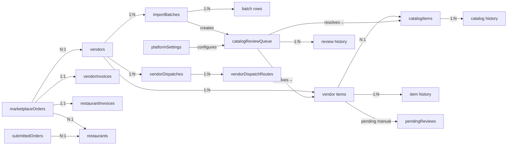

# RestIQ Marketplace — Firestore Data Structure

Complete schema reference for every Firestore collection used in the project.
All system timestamps use Firestore `Timestamp` objects via `serverTimestamp()`.
Business planning date keys (e.g. `weekStart`, `deliveryDateKey`) remain as ISO strings.

> **Architecture:** The system uses a lean 4-collection top-level design:
> `vendors`, `catalogItems`, `catalogReviewQueue`, `platformSettings`
> All other data lives as subcollections or in dedicated operational collections.

---

## Collection Hierarchy

```mermaid
graph TD
    V[vendors] --> VI[vendors/*/items]
    VI --> VIH[vendors/*/items/*/history]
    V --> VIB[vendors/*/importBatches]
    VIB --> VIBR[vendors/*/importBatches/*/rows]
    CI[catalogItems] --> CIH[catalogItems/*/history]
    CRQ[catalogReviewQueue] --> CRQH[catalogReviewQueue/*/history]
    PS[platformSettings]
    R[restaurants]
    MO[marketplaceOrders]
    SO[submittedOrders]
    VD[vendorDispatches]
    VDR[vendorDispatchRoutes]
    VINV[vendorInvoices]
    RINV[restaurantInvoices]
    N[notifications]
    PR[pendingReviews]
    L[login]
    ACL[adminChangeLogs]
    ML[migrationLogs]
    FC[forecastConfig]
    FEST[festivalCalendar]
    ID[issuesDisputes]
    FCE[forecast/corrections/entries]
```

---

## 1. `vendors`

Master vendor/supplier profiles.

| Field | Type | Description |
|---|---|---|
| `name` | string | Company display name |
| `companyName` | string | Legal company name |
| `contactPerson` | string | Primary contact name |
| `phone` | string | Phone number |
| `email` | string | Contact email |
| `address` | string | Street address |
| `city` | string | City |
| `province` | string | Province/state code (e.g. `"ON"`) |
| `country` | string | Country (e.g. `"Canada"`) |
| `category` | string | Vendor category |
| `status` | string | `"active"` \| `"inactive"` |
| `commissionPercent` | number | Marketplace commission % (default 10) |
| `notes` | string | Admin notes |
| `createdAt` | Timestamp | Server-set creation time |
| `updatedAt` | Timestamp | Server-set last update time |

---

## 2. `vendors/{vendorId}/items`

Items offered by a specific vendor. Subcollection under each vendor.

> **Field name change:** `name` was renamed to `itemName`. New normalized/SKU fields added.

| Field | Type | Description |
|---|---|---|
| `itemName` | string | Item display name (**canonical field**; replaces old `name`) |
| `itemNameNormalized` | string | Lowercase, stripped normalized key for matching |
| `vendorSKU` | string | Vendor's own SKU / product code |
| `category` | string | `"Produce"` \| `"Meat"` \| `"Seafood"` \| `"Dairy"` \| `"Spices"` \| `"Grains"` \| `"Beverages"` \| `"Packaging"` \| `"Cleaning"` \| `"Other"` |
| `brand` | string | Brand name |
| `packSize` | string | Pack size as a human string (e.g. `"10 kg"`) |
| `packSizeNormalized` | string | Normalized pack size for matching |
| `unit` | string | Selling unit (`"kg"`, `"lb"`, `"bag"`, `"bunch"`, `"box"`, `"case"`, `"unit"`, `"dozen"`, `"packet"`, `"L"`, `"mL"`) |
| `unitNormalized` | string | Normalized unit for matching |
| `vendorPrice` | number | Price charged by vendor |
| `currency` | string | Currency code (default `"CAD"`) |
| `minOrderQty` | string | Minimum order quantity |
| `leadTimeDays` | string | Lead time in days |
| `status` | string | `"Active"` \| `"Inactive"` \| `"Pending Review"` \| `"Merged"` |
| `notes` | string | Vendor-supplied notes |
| `catalogItemId` | string \| null | Link to master `catalogItems` doc |
| `mappingStatus` | string | `"mapped"` \| `"unmapped"` \| `"pending_review"` |
| `mappingConfidence` | number \| null | Match confidence score (0–1) if auto-matched |
| `mappingSource` | string \| null | How it was mapped: `"manual"` \| `"import"` \| `"auto"` |
| `sourceLastUpdated` | string | Last update source: `"manual"` \| `"import"` \| `"import_high_risk_approved"` |
| `lastImportBatchId` | string \| null | ID of the import batch that last updated this item |
| `mergedIntoItemId` | string | If status `"Merged"`, the target item ID |
| `createdAt` | Timestamp | Server-set creation time |
| `updatedAt` | Timestamp | Server-set last update time |
| `createdBy` | string | User display name / ID who created |
| `updatedBy` | string | User display name / ID who last updated |

> **Legacy fields** (present on older docs, being phased out): `name`, `vendorPrice` (was sometimes stored as `price`), `packQuantity`, `taxable`, `imageUrl`, `changeType`, `proposedData`, `originalData`, `requestedBy`, `requestedByName`, `requestedAt`, `rejectionComment`, `proofUrls`

---

## 3. `vendors/{vendorId}/items/{itemId}/history`

Per-item change history. Replaces the old `auditLog` subcollection.

| Field | Type | Description |
|---|---|---|
| `changedBy` | string | User display name / ID who made the change |
| `changeSource` | string | `"manual"` \| `"import"` \| `"import_high_risk_approved"` |
| `importBatchId` | string | Import batch ID (if applicable) |
| `changedFields` | string[] | List of field names that changed |
| `oldValues` | object | Field values before change |
| `newValues` | object | Field values after change (or full doc snapshot on create) |
| `notes` | string | Human-readable note (e.g. `"Item created"`) |
| `changedAt` | Timestamp | Server-set time of change |

---

## 4. `vendors/{vendorId}/importBatches`

Bulk import batch header records. One document per CSV upload.

| Field | Type | Description |
|---|---|---|
| `vendorId` | string | Parent vendor doc ID |
| `fileName` | string | Uploaded file name |
| `importMode` | string | `"add_and_update"` \| `"add_only"` \| `"update_only"` |
| `uploadedBy` | string | User ID who uploaded |
| `uploadedByName` | string | User display name |
| `uploadedAt` | Timestamp | Server-set upload time |
| `totalRows` | number | Total rows in the CSV |
| `createdCount` | number | Items created |
| `updatedHighCount` | number | High-confidence updates applied |
| `updatedMediumCount` | number | Medium-confidence updates applied |
| `unchangedCount` | number | Rows with no changes |
| `warningCount` | number | Rows with warnings |
| `errorCount` | number | Rows with errors |
| `reviewCount` | number | Rows sent to review queue |
| `skippedCount` | number | Rows skipped |
| `status` | string | `"in_progress"` \| `"completed"` |
| `templateVersion` | string | CSV template version (e.g. `"1.0"`) |
| `completedAt` | Timestamp | When batch finalized |

### 4a. `vendors/{vendorId}/importBatches/{batchId}/rows`

Per-row results for an import batch.

| Field | Type | Description |
|---|---|---|
| `rowNumber` | number | Row index in the CSV |
| `rawData` | object | `{ itemName, price, category, brand, packSize, unit, status, vendorSKU }` — raw CSV values |
| `matchType` | string | How the item was matched: `"exact"` \| `"normalized"` \| `"alias"` \| `"none"` |
| `matchedItemId` | string \| null | Matched vendor item doc ID |
| `actionTaken` | string | `"created"` \| `"update_high"` \| `"update_medium"` \| `"needs_review"` \| `"high_risk_review"` \| `"unchanged"` \| `"error"` \| `"none"` |
| `changedFields` | string[] | Which fields differed |
| `oldValues` | object | Previous field values |
| `newValues` | object | New values written |
| `warningMessages` | string[] | Warning messages for this row |
| `errorMessages` | string[] | Error messages for this row |
| `excluded` | boolean | Whether user manually excluded this row |
| `createdItemId` | string \| null | Newly created vendor item ID (if applicable) |

---

## 5. `catalogItems`

Master product catalog — canonical, deduplicated product references.

| Field | Type | Description |
|---|---|---|
| `itemName` | string | Official item name |
| `itemNameNormalized` | string | Lowercase normalized key for matching |
| `canonicalName` | string | Official display name (preferred for UI) |
| `category` | string | Product category |
| `subcategory` | string | Optional subcategory |
| `brand` | string | Brand name |
| `packSize` | string | Reference pack size string |
| `packSizeNormalized` | string | Normalized pack size for matching |
| `baseUnit` | string | Standard unit of measure |
| `orderUnit` | string | Unit used when ordering |
| `aliases` | string[] | Alternative raw names for this item |
| `aliasNormalized` | string[] | Normalized form of each alias |
| `status` | string | `"active"` \| `"inactive"` \| `"merged"` |
| `source` | string | `"superadmin"` \| `"import"` \| `"migration"` |
| `approved` | boolean | Whether a superadmin has approved this entry |
| `mergedInto` | string | If status `"merged"`, the survivor catalog item ID |
| `createdAt` | Timestamp | Server-set creation time |
| `updatedAt` | Timestamp | Server-set last update time |
| `createdBy` | string | User display name / ID |
| `updatedBy` | string | User display name / ID |

### 5a. `catalogItems/{catalogItemId}/history`

Audit trail for catalog item merges and admin changes.

| Field | Type | Description |
|---|---|---|
| `action` | string | `"merged_from"` \| `"alias_added"` \| `"updated"` |
| `actionBy` | string | User display name / ID |
| `actionAt` | Timestamp | Server-set time |
| `notes` | string | Human-readable description |
| `losingItemId` | string | (merge only) The catalog item that was merged in |
| `vendorItemsRemapped` | number | (merge only) Count of vendor items re-pointed |

---

## 6. `catalogReviewQueue`

Superadmin review queue for all items that cannot be auto-processed during a bulk import. Replaces `catalogItemMappingReview` and `pendingReviews` for import-originated reviews.

| Field | Type | Description |
|---|---|---|
| `reviewType` | string | `"new_item"` \| `"possible_duplicate"` \| `"high_risk_update"` \| `"mapping_review"` \| `"needs_review"` |
| `status` | string | `"pending"` \| `"approved"` \| `"rejected"` \| `"merged"` \| `"held"` |
| `vendorId` | string | Vendor doc ID |
| `vendorName` | string | Vendor display name |
| `vendorItemId` | string | Vendor item doc ID (may be empty if no item created yet) |
| `importBatchId` | string | Import batch that triggered this review |
| `importRowId` | string | Row number (as string) in the CSV |
| `source` | string | `"vendor_import"` |
| `proposedData` | object | `{ itemName, category, brand, packSize, unit, price, currency, vendorSKU, minOrderQty, status, notes }` |
| `existingVendorItemData` | object | Snapshot of the current vendor item (if update) |
| `suggestedCatalogMatches` | array | `[{ catalogItemId, canonicalName, score, ... }]` — ranked catalog match suggestions |
| `suggestedVendorMatches` | array | `[{ itemId, itemName, score, ... }]` — ranked vendor item match suggestions |
| `matchConfidence` | number \| null | Top match confidence score |
| `riskFlags` | string[] | Risk flag labels (e.g. `["Price change > 50%", "Pack size changed"]`) |
| `reviewReason` | string | Human-readable reason this item is in queue |
| `resolutionAction` | string \| null | `"mapped_to_catalog_item"` \| `"created_new_catalog_item"` \| `"approved_high_risk_update"` \| `"merged_into_existing_vendor_item"` \| `"rejected"` \| null |
| `resolutionNotes` | string \| null | Notes about how it was resolved |
| `createdAt` | Timestamp | Server-set creation time |
| `createdBy` | string | User display name / ID |
| `reviewedAt` | Timestamp \| null | When reviewed |
| `reviewedBy` | string \| null | Reviewer display name / ID |

**Status Enum Flow:**
`"pending"` → `"approved"` / `"rejected"` / `"merged"` / `"held"` → (held can return to) `"pending"`

### 6a. `catalogReviewQueue/{reviewId}/history`

Action history for each review item.

| Field | Type | Description |
|---|---|---|
| `action` | string | `"approved_map_to_existing"` \| `"approved_created_new_catalog_item"` \| `"approved_high_risk_update"` \| `"merged_into_existing"` \| `"rejected"` \| `"held"` \| `"reverted_mapping"` |
| `actionBy` | string | User display name / ID |
| `actionAt` | Timestamp | Server-set time |
| `notes` | string | Human-readable description |
| `oldStatus` | string | Status before this action |
| `newStatus` | string | Status after this action |

---

## 7. `platformSettings`

Platform-wide configuration. Two documents exist:

### `platformSettings/catalogMatching`

Controls the catalog matching engine scoring weights and thresholds.

| Field | Type | Default | Description |
|---|---|---|---|
| `exactNameWeight` | number | `10.0` | Score weight for exact name matches |
| `normalizedNameWeight` | number | `8.0` | Score weight for normalized name matches |
| `aliasWeight` | number | `7.0` | Score weight for alias matches |
| `categoryWeight` | number | `2.0` | Score weight for matching category |
| `packSizeWeight` | number | `3.0` | Score weight for matching pack size |
| `unitWeight` | number | `1.5` | Score weight for matching unit |
| `priorMappingWeight` | number | `5.0` | Score boost for previously mapped items |
| `duplicateThreshold` | number | `0.85` | Score above which → flagged as possible duplicate |
| `reviewThreshold` | number | `0.55` | Score above which → sent to review queue |
| `autoMatchThreshold` | number | `0.90` | Score above which → auto-matched without review |
| `autoAddAliasOnApprovedReview` | boolean | `true` | Whether to add alias when a review is approved |
| `allowPluralSingularEquivalence` | boolean | `true` | Treat singular/plural as equivalent in matching |
| `allowProduceVariants` | boolean | `true` | Treat produce variant spellings as equivalent |
| `updatedAt` | Timestamp | — | Last updated |
| `updatedBy` | string | — | User who last updated |

### `platformSettings/importRules`

Controls behavior of the vendor bulk import pipeline.

| Field | Type | Default | Description |
|---|---|---|---|
| `autoApplyRecommendedReview` | boolean | `false` | If true, auto-applies moderate-confidence recommendations |
| `highRiskThresholdPercent` | number | `50` | Price change % above which item is flagged as high-risk |
| `duplicateSimilarityThreshold` | number | `0.90` | Similarity score above which a new item is flagged as a duplicate |
| `requireReviewForAllNewItems` | boolean | `false` | If true, all new items go to review queue regardless of confidence |
| `defaultReviewBehavior` | string | `"queue"` | `"queue"` \| `"auto_approve"` — what to do with items needing review |
| `updatedAt` | Timestamp | — | Last updated |
| `updatedBy` | string | — | User who last updated |

---

## 8. `restaurants`

Master restaurant/branch profiles.

| Field | Type | Description |
|---|---|---|
| `restaurantId` | string | Deterministic ID |
| `name` | string | Restaurant display name |
| `code` | string | Short code identifier |
| `branchType` | string | `"restaurant"` |
| `status` | string | `"active"` \| `"inactive"` |
| `phone` | string | Contact phone |
| `email` | string | Contact email |
| `addressLine1` | string | Street address |
| `city` | string | City |
| `province` | string | Province code |
| `postalCode` | string | Postal/ZIP code |
| `deliveryDays` | string[] | e.g. `["Monday", "Thursday"]` |
| `forecastEnabled` | boolean | Whether forecasting is active |
| `subscriptionPlan` | string | e.g. `"marketplace-basic"` |
| `notes` | string | Admin notes |
| `createdAt` | Timestamp | Server-set creation time |
| `updatedAt` | Timestamp | Server-set last update time |

---

## 9. `marketplaceOrders`

Live marketplace orders — the central transactional collection.

| Field | Type | Description |
|---|---|---|
| `orderGroupId` | string | Display group ID (e.g. `"A3F8B2C1"`) |
| `vendorId` | string | Assigned vendor |
| `vendorName` | string | Vendor display name |
| `restaurantId` | string | Ordering restaurant |
| `restaurantName` | string | Restaurant display name |
| `status` | string | See status enum below |
| `items` | array | Order line items (see below) |
| `subtotalBeforeTax` | number | Pre-tax subtotal |
| `totalTax` | number | Total tax amount |
| `total` | number | Grand total (subtotal + tax) |
| `issueStatus` | string | `null` \| `"open"` \| `"resolved"` |
| `issueDetails` | object | `{ type, description, raisedBy }` |
| `resolution` | object | `{ type, details, resolvedBy, resolvedAt: Timestamp }` |
| `auditLog` | array | `[{ action, reason, timestamp: Timestamp, user }]` |
| `cancelReason` | string | Reason for cancellation |
| `deliveredAt` | Timestamp | When marked delivered |
| `cancelledAt` | Timestamp | When cancelled |
| `resolvedAt` | Timestamp | When issue was resolved |
| `reviewWindowEndsAt` | string | Computed date: delivery + 48h (ISO) |
| `createdAt` | Timestamp | Server-set creation time |

**Order Status Enum:**
`"new"` → `"pending_confirmation"` → `"confirmed"` → `"delivered_awaiting_confirmation"` → `"fulfilled"`
Branch: → `"in_review"` → `"fulfilled"` (after resolution)
Branch: → `"cancelled_by_vendor"` / `"cancelled_by_customer"` / `"cancelled"` / `"rejected"`

**Order Line Item Shape:**

| Field | Type | Description |
|---|---|---|
| `itemId` | string | Vendor item doc ID |
| `itemName` / `name` | string | Item display name |
| `qty` | number | Quantity ordered |
| `price` / `vendorPrice` | number | Price at time of order |
| `unit` | string | Unit of measure |
| `taxable` | boolean | Whether this line is taxable |
| `lineSubtotal` | number | `price × qty` |

---

## 10. `submittedOrders`

Restaurant-submitted orders from the forecast review pipeline.

| Field | Type | Description |
|---|---|---|
| `suggestionId` | string | Deterministic doc ID |
| `restaurantId` | string | Restaurant identifier |
| `restaurantName` | string | Restaurant display name |
| `deliveryDay` | string | `"Monday"` \| `"Thursday"` |
| `weekStart` | string | ISO date for Monday of delivery week |
| `weekLabel` | string | Human-readable week label |
| `status` | string | `"Draft Suggestion"` → `"In Review"` → `"Submitted"` → `"Locked"` → `"Aggregated"` → `"Sent to Vendor"` |
| `submittedAt` | Timestamp | When submitted |
| `lockedAt` | Timestamp | When locked |
| `aggregatedAt` | Timestamp | When aggregated |
| `updatedAt` | Timestamp | Last status change |
| `predictedItemsCount` | number | AI predicted item count |
| `predictedTotalPacks` | number | AI predicted total packs |
| `finalItemsCount` | number | Final confirmed item count |
| `finalTotalPacks` | number | Final total packs |
| `changesCount` | number | Number of corrections |
| `netPackDelta` | number | Net change in packs |
| `predictionConfidence` | number | AI confidence score |
| `predictedEstimatedSpend` | number | Predicted spend |
| `finalEstimatedSpend` | number | Final spend |
| `spendDelta` | number | Spend difference |
| `items` | array | `[{ itemId, itemName, category, packLabel, predictedQty, finalQty, deltaQty, deltaType, note, totalQty, lineRestaurantBilling }]` |

---

## 11. `vendorDispatches`

Weekly parent dispatch records — one per vendor per week.

| Field | Type | Description |
|---|---|---|
| `dispatchId` | string | Deterministic ID: `disp_{vendorId}_{weekStart}` |
| `vendorId` | string | Vendor doc ID |
| `vendorName` | string | Vendor display name |
| `weekStart` | string | ISO date (Monday) |
| `weekEnd` | string | ISO date (Sunday) |
| `weekLabel` | string | Human-readable label |
| `routeDays` | string[] | `["Monday", "Thursday"]` |
| `mondayTotalPacks` | number | Monday pack count |
| `thursdayTotalPacks` | number | Thursday pack count |
| `restaurantBillingTotal` | number | Total restaurant billing |
| `vendorPayoutTotal` | number | Total vendor payout |
| `marketplaceCommissionTotal` | number | Total commission |
| `overallStatus` | string | Derived: `"Draft"` \| `"Sent"` \| `"In Progress"` \| `"Partial"` \| `"Confirmed"` \| `"Delivered"` \| `"Closed"` |
| `mondaySent` | boolean | Whether Monday dispatch was sent |
| `thursdaySent` | boolean | Whether Thursday dispatch was sent |
| `sentAt` | Timestamp | When dispatched |
| `confirmedAt` | Timestamp \| null | When confirmed |
| `deliveredAt` | Timestamp \| null | When delivered |
| `items` | array | Full items payload (see shape below) |
| `createdAt` | Timestamp | Server-set creation time |
| `updatedAt` | Timestamp | Server-set last update time |

**Dispatch Item Shape:**

| Field | Type | Description |
|---|---|---|
| `itemId` | string | Lowercased item name slug |
| `itemName` | string | Item display name |
| `packLabel` | string | Pack display string |
| `mondayQty` | number | Monday quantity |
| `thursdayQty` | number | Thursday quantity |
| `catalogSellPrice` | number | Catalog selling price |
| `lineMarketplaceCommission` | number | Commission for this line |
| `lineVendorPayout` | number | Vendor payout for this line |
| `lineRestaurantBilling` | number | Restaurant billing for this line |
| `category` | string | Item category |
| `vendorItemId` | string \| null | **Snapshot:** vendor item doc ID |
| `catalogItemId` | string \| null | **Snapshot:** catalog item ID |
| `itemNameSnapshot` | string | **Snapshot:** item name at dispatch time |
| `priceSnapshot` | number | **Snapshot:** vendor price at dispatch time |
| `unitSnapshot` | string | **Snapshot:** unit at dispatch time |
| `vendorNameSnapshot` | string \| null | **Snapshot:** vendor name |
| `packSizeSnapshot` | number \| null | **Snapshot:** pack quantity |
| `categorySnapshot` | string \| null | **Snapshot:** category |
| `taxableSnapshot` | boolean | **Snapshot:** taxable flag |

---

## 12. `vendorDispatchRoutes`

Route-day child dispatch records — pipeline tracking per delivery day.

| Field | Type | Description |
|---|---|---|
| `routeDispatchId` | string | `{dispatchId}_{Day}` |
| `dispatchId` | string | Parent dispatch ID |
| `vendorId` | string | Vendor doc ID |
| `vendorName` | string | Vendor display name |
| `weekStart` | string | ISO date (Monday) |
| `weekEnd` | string | ISO date (Sunday) |
| `weekLabel` | string | Human-readable label |
| `routeDay` | string | `"Monday"` \| `"Thursday"` |
| `totalPacks` | number | Total packs for this route |
| `status` | string | `"Draft"` \| `"Sent"` \| `"Confirmed"` \| `"Partially Confirmed"` \| `"Delivered"` \| `"Closed"` |
| `sentAt` | Timestamp | When sent to vendor |
| `confirmedAt` | Timestamp \| null | When vendor confirmed |
| `deliveredAt` | Timestamp \| null | When delivered |
| `warehouseStatus` | string \| null | Warehouse processing status |
| `items` | array | Route-filtered items (same shape as dispatch items + `qty` field) |
| `notes` | string | Route notes |
| `createdAt` | Timestamp | Server-set creation time |
| `updatedAt` | Timestamp | Server-set last update time |

---

## 13. `vendorInvoices`

Auto-generated vendor invoices (commission deducted). Doc ID = order ID.

| Field | Type | Description |
|---|---|---|
| `orderId` | string | Linked marketplace order ID |
| `orderGroupId` | string | Display group ID |
| `vendorId` | string | Vendor doc ID |
| `restaurantId` | string | Restaurant identifier |
| `invoiceNumber` | string | `INV-V-{base}` |
| `invoiceDate` | Timestamp | Invoice generation date |
| `dueDate` | string | ISO date (30 days from creation) |
| `paymentStatus` | string | `"PENDING"` \| `"PAID"` |
| `subtotalVendorAmount` | number | Pre-tax subtotal |
| `totalTaxAmount` | number | Total tax |
| `totalVendorAmount` | number | Gross total (subtotal + tax) |
| `grossVendorAmount` | number | Same as subtotalVendorAmount |
| `commissionPercent` | number | Commission rate |
| `commissionAmount` | number | Commission deducted |
| `netVendorPayable` | number | Gross − commission |
| `commissionModel` | string | `"VENDOR_FLAT_PERCENT"` |
| `items` | array | `[{ itemId, itemName, unit, qty, vendorPrice, lineTotalVendor, isTaxable, lineTax }]` |
| `adminNotes` | string | Generation method note |
| `createdAt` | Timestamp | Server-set creation time |
| `updatedAt` | Timestamp | Server-set last update time |

---

## 14. `restaurantInvoices`

Auto-generated restaurant invoices (full amount, no commission). Doc ID = order ID.

| Field | Type | Description |
|---|---|---|
| `orderId` | string | Linked marketplace order ID |
| `orderGroupId` | string | Display group ID |
| `vendorId` | string | Vendor doc ID |
| `vendorName` | string | Vendor display name |
| `restaurantId` | string | Restaurant identifier |
| `invoiceNumber` | string | `INV-C-{base}` |
| `invoiceDate` | Timestamp | Invoice generation date |
| `dueDate` | string | ISO date (30 days from creation) |
| `paymentStatus` | string | `"PENDING"` \| `"PAID"` |
| `subtotal` | number | Pre-tax subtotal |
| `totalTax` | number | Total tax |
| `grandTotal` | number | Subtotal + tax |
| `items` | array | `[{ itemId, itemName, unit, qty, price, lineTotal, isTaxable, lineTax }]` |
| `adminNotes` | string | Generation method note |
| `createdAt` | Timestamp | Server-set creation time |
| `updatedAt` | Timestamp | Server-set last update time |

---

## 15. `notifications`

Real-time notification system for admins and vendors.

| Field | Type | Description |
|---|---|---|
| `orderId` | string | Related order ID |
| `type` | string | `"NEW_ORDER"` \| `"ORDER_CANCELLED"` \| `"STATUS_CHANGED"` \| `"DELIVERY_CONFIRMED"` \| `"ISSUE_RAISED"` \| `"ORDER_UPDATED"` \| `"ITEM_ADDED"` \| `"ITEM_EDIT_SUBMITTED"` |
| `role` | string | `"ADMIN"` \| `"VENDOR"` |
| `vendorId` | string | Target vendor (for vendor notifications) |
| `title` | string | Notification title |
| `message` | string | Notification body |
| `isRead` | boolean | Read status |
| `createdAt` | Timestamp | Server-set creation time |

---

## 16. `pendingReviews`

Legacy vendor item change review queue (pre-import-pipeline).
Used for manual add/edit/delete requests submitted through the vendor portal.

| Field | Type | Description |
|---|---|---|
| `vendorId` | string | Vendor doc ID |
| `itemId` | string | Vendor item doc ID |
| `itemName` | string | Item name |
| `vendorName` | string | Vendor display name |
| `changeType` | string | `"edit"` \| `"delete"` |
| `originalData` | object | Fields before change |
| `proposedData` | object | Proposed changes |
| `requestedBy` | string | User ID |
| `requestedByName` | string | User display name |
| `requestedAt` | Timestamp | When request was made |
| `status` | string | `"pending"` \| `"approved"` \| `"rejected"` |
| `reviewedBy` | string | Admin user ID who reviewed |
| `reviewedByName` | string | Admin display name |
| `reviewedAt` | Timestamp | When reviewed |
| `rejectionComment` | string | Reason for rejection |

---

## 17. `login`

User accounts and authentication.

| Field | Type | Description |
|---|---|---|
| `displayName` | string | User display name |
| `username` | string | Login username (lowercase) |
| `email` | string \| null | Email address |
| `password` | string | Password (plain text — dev only) |
| `role` | string | `"superadmin"` \| `"admin"` \| `"vendor"` |
| `vendorId` | string | Associated vendor doc ID |
| `vendorName` | string | Associated vendor name |
| `active` | boolean | Account active status |
| `createdBy` | string | User ID who created this account |
| `createdAt` | Timestamp | Server-set creation time |

---

## 18. `adminChangeLogs`

Admin audit trail for all administrative actions.

| Field | Type | Description |
|---|---|---|
| `entityType` | string | `"restaurant"` \| `"catalogItem"` \| `"vendorItem"` \| `"mappingReview"` |
| `entityId` | string | Document ID that was changed |
| `action` | string | `"created"` \| `"updated"` \| `"status_changed"` \| `"mapped"` \| `"ignored"` \| `"bulk_update"` \| `"deleted"` \| `"review_approved"` \| `"review_rejected"` |
| `changedBy` | string | User display name |
| `changedFields` | object | `{ field: { from, to } }` |
| `metadata` | object | Additional context |
| `timestamp` | Timestamp | Server-set time of action |

---

## 19. `migrationLogs`

Records of data migration/backfill runs.

| Field | Type | Description |
|---|---|---|
| `type` | string | `"restaurantsBackfill"` \| `"catalogItemsBackfill"` |
| `startedAt` | string | ISO timestamp of job start |
| `completedAt` | string | ISO timestamp of job end |
| `status` | string | `"completed"` \| `"completed_with_errors"` |
| `totalProcessed` | number | Total items scanned |
| `totalCreated` | number | New documents created |
| `totalUpdated` | number | Documents updated |
| `totalSkipped` | number | Skipped (already existed) |
| `totalNeedsReview` | number | Sent to review queue |
| `errorCount` | number | Errors encountered |
| `notes` | string | Summary description |
| `createdAt` | Timestamp | Server-set creation time |

---

## 20. `forecastConfig`

Global forecast engine configuration. Single document: `forecastConfig/global`.

| Field | Type | Description |
|---|---|---|
| `safetyBufferPercent` | number | e.g. `0.15` (15% safety buffer) |
| `defaultMondaySplit` | number | e.g. `0.40` (40% Mon-Wed allocation) |
| `defaultThursdaySplit` | number | e.g. `0.60` (60% Thu-Sun allocation) |

---

## 21. `festivalCalendar`

Festival/seasonal event calendar for forecast demand uplift.

| Field | Type | Description |
|---|---|---|
| `eventName` | string | Event name (e.g. `"Onam Week"`) |
| `startDate` | string | ISO date (start) |
| `endDate` | string | ISO date (end) |
| `isActive` | boolean | Whether event is active |
| `notes` | string | Event notes |
| `upliftRules` | array | `[{ targetType: "category", targetValue: string, percent: number }]` |

---

## 22. `issuesDisputes`

Delivery issues and disputes raised by restaurants.

| Field | Type | Description |
|---|---|---|
| `issueType` | string | `"Missing Item"` \| `"Incorrect Item"` \| `"Damaged Item"` \| `"Replacement Requested"` \| `"Short Quantity"` \| `"Wrong Pack Size"` |
| `restaurantName` | string | Restaurant name |
| `vendorName` | string | Vendor name |
| `itemName` | string | Affected item |
| `deliveryDay` | string | `"Monday"` \| `"Thursday"` |
| `description` | string | Issue description |
| `submittedOrderId` | string | Related submitted order |
| `dispatchId` | string | Related dispatch |
| `status` | string | `"Open"` \| `"Vendor Reviewing"` \| `"Replacement Approved"` \| `"Resolved"` \| `"Closed"` |
| `createdAt` | Timestamp | Server-set creation time |
| `updatedAt` | Timestamp | Server-set last update time |

---

## 23. `forecast/corrections/entries`

Item-level forecast correction data (learning engine). Subcollection under `forecast/corrections`.

| Field | Type | Description |
|---|---|---|
| `correctionId` | string | Auto-generated doc ID |
| `restaurantId` | string | Restaurant identifier |
| `restaurantName` | string | Restaurant display name |
| `itemId` | string | Item identifier |
| `itemName` | string | Item name |
| `category` | string | Item category |
| `deliveryDay` | string | `"Monday"` \| `"Thursday"` |
| `weekStart` | string | ISO date for week start |
| `weekLabel` | string | Human-readable week label |
| `predictedQty` | number | AI predicted quantity |
| `finalQty` | number | Restaurant's final quantity |
| `deltaQty` | number | `finalQty - predictedQty` |
| `deltaType` | string | `"Added"` \| `"Removed"` \| `"Increased"` \| `"Reduced"` \| `"Unchanged"` |
| `packLabel` | string | Pack unit label |
| `catalogPrice` | number | Catalog price at time |
| `submittedAt` | Timestamp | Server-set time of submission |
| `suggestionId` | string | Parent submitted order ID |

---

## Key Relationships

---

## Deprecated / Removed Collections

| Collection | Status | Replaced By |
|---|---|---|
| `vendors/*/items/*/auditLog` | **Removed** | `vendors/*/items/*/history` |
| `catalogItemMappingReview` | **Superseded** | `catalogReviewQueue` (for import-originated reviews) |
| `catalogMappingsHistory` | **Removed** | `catalogReviewQueue/*/history` |

---

## Timestamp Convention Summary

| Category | Example Fields | Type | Notes |
|---|---|---|---|
| System events | `createdAt`, `updatedAt`, `sentAt`, `confirmedAt`, `deliveredAt`, `cancelledAt`, `resolvedAt`, `reviewedAt`, `submittedAt`, `requestedAt`, `lockedAt`, `aggregatedAt`, `changedAt`, `actionAt`, `uploadedAt`, `completedAt` | `Timestamp` | Always `serverTimestamp()` |
| Audit log timestamps | `timestamp` (in auditLog, adminChangeLogs) | `Timestamp` | Always `serverTimestamp()` |
| Business date keys | `weekStart`, `weekEnd`, `startDate`, `endDate`, `deliveryDateKey` | `string` | ISO date (`YYYY-MM-DD`) for queries/planning |
| Computed future dates | `dueDate`, `reviewWindowEndsAt` | `string` | Calculated from current time + offset |
| Migration log times | `startedAt`, `completedAt` (in migrationLogs) | `string` | ISO timestamp of job run boundaries |
